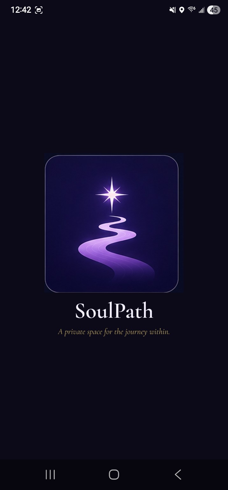
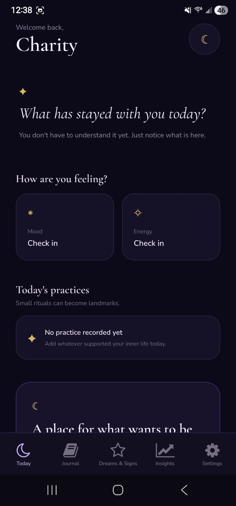
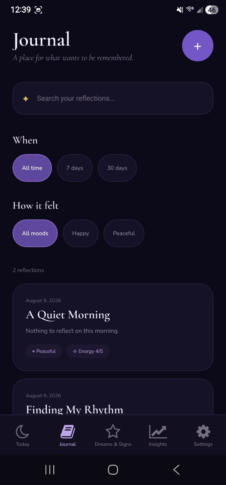
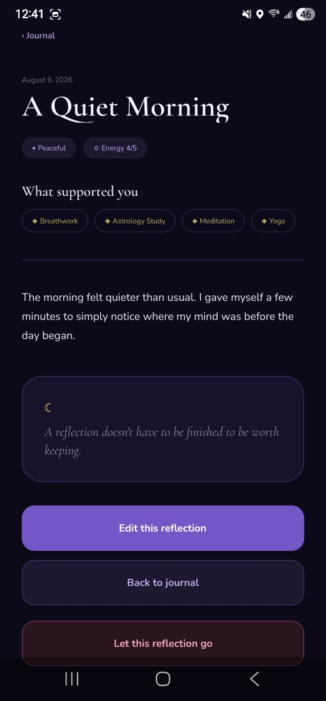
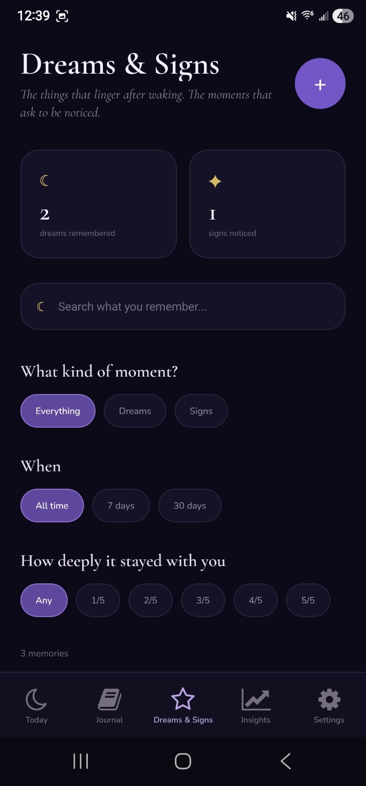
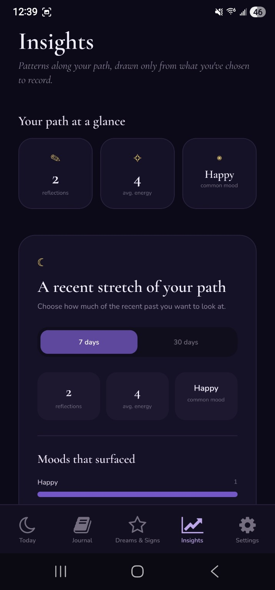
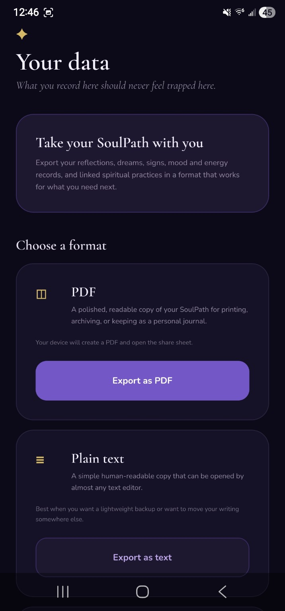

# SoulPath Journal

> **A private space for the journey within.**

SoulPath Journal is a cross-platform journaling and self-reflection application built with React Native, Expo, TypeScript, and Supabase.

The app gives users a private place to record daily reflections, track mood and energy, document dreams and meaningful experiences, record spiritual practices, notice patterns over time, and export their data in portable formats.

SoulPath was built as a portfolio-quality mobile application with an emphasis on privacy, reliable data handling, thoughtful UX, accessibility, and cross-platform behavior.

---

## ✦ App Preview

<p align="center">
  
</p>

<p align="center">
  <em>A private space for the journey within.</em>
</p>

---

## ✦ Core Features

### Daily Reflection

Create and revisit personal journal entries with:

* Title and reflection content
* Mood tracking
* Energy tracking
* Local-calendar-safe journal dates
* Associated spiritual practices
* Search and filtering
* Multiple reflections per day

<p align="center">
  
  &nbsp;&nbsp;
  
</p>

---

### Journal Details

Each reflection can include mood, energy, written content, and linked practices.

Users can revisit, edit, or delete individual reflections through a dedicated detail workflow.

<p align="center">
  
</p>

---

### Dreams & Signs

SoulPath includes a separate space for recording meaningful experiences such as:

* Dreams
* Synchronicities
* Personal interpretations
* Significance ratings
* Exact date and time

SoulPath presents these experiences as personal observations rather than predictions or claims about their meaning.

<p align="center">
  
</p>

---

### Spiritual Practices

Journal entries can be connected with practices including:

* Meditation
* Prayer
* Tarot
* Astrology Study
* Breathwork
* Yoga
* Shadow Work
* Traditional Chinese Medicine routines
* Ayurvedic routines
* Dream Interpretation

Practice relationships are stored separately from journal entries and linked through relational database records.

---

### Insights

SoulPath creates observational summaries from the user's own records.

Insights can surface patterns involving:

* Journaling frequency
* Mood
* Energy
* Practices
* Dreams
* Synchronicities
* Recent activity periods

The application intentionally avoids medical, causal, predictive, or divinatory claims.

<p align="center">
  
</p>

---

### Search & Filters

Journal records can be filtered by:

* Search text
* Mood
* Recent time periods

Dreams & Signs can be filtered by:

* Experience type
* Recent time periods
* Significance level

Filtering is designed around a personal journal dataset while maintaining a simple and responsive interface.

---

### Data Export

Users can take their SoulPath data with them at any time.

Supported export formats:

* **PDF** — polished human-readable journal export
* **TXT** — lightweight portable text backup
* **JSON** — structured data export with a versioned schema

Native Android and iOS exports use the system share sheet, while web exports use browser-compatible download and printing behavior.

Authentication credentials, passwords, access tokens, refresh tokens, and application secrets are never included in exports.

<p align="center">
  
</p>

---

## ☾ Privacy & Security

SoulPath is designed around private, user-owned data.

Security features include:

* Supabase authentication
* User-scoped PostgreSQL records
* Row Level Security policies
* Authenticated CRUD operations
* Explicit user filtering in service operations
* Session-expiration handling
* Session recovery
* Secure client configuration
* No service-role credentials in the mobile client
* Data deletion controls
* Portable user exports

Users can delete their recorded journal and experience data while retaining their account and profile.

---

## Architecture

```text
SoulPath Journal
│
├── React Native / Expo UI
│
├── Expo Router
│   ├── Authentication routes
│   ├── Tab navigation
│   ├── Journal routes
│   ├── Dreams & Signs routes
│   └── Settings routes
│
├── Shared UI System
│   ├── SoulScreen
│   ├── SoulButton
│   ├── SoulInput
│   ├── SoulCard
│   ├── EmptyState
│   ├── FeedbackMessage
│   └── AnimatedSoulPathLaunch
│
├── Application Services
│   ├── Journal Service
│   ├── Practice Service
│   ├── Experience Service
│   ├── Insight Service
│   └── Export Service
│
└── Supabase
    ├── Authentication
    ├── PostgreSQL
    ├── Row Level Security
    └── Atomic journal/practice updates
```

---

## Tech Stack

| Area                | Technology                  |
| ------------------- | --------------------------- |
| Mobile / Web        | React Native                |
| Framework           | Expo SDK 57                 |
| Language            | TypeScript                  |
| Routing             | Expo Router                 |
| Authentication      | Supabase Auth               |
| Database            | PostgreSQL / Supabase       |
| Authorization       | Row Level Security          |
| Local / Native APIs | Expo APIs                   |
| PDF Export          | Expo Print                  |
| File Export         | Expo FileSystem             |
| Native Sharing      | Expo Sharing                |
| Fonts               | Cormorant Garamond + Nunito |
| Android Builds      | EAS Build                   |

---

## Reliability Engineering

SoulPath includes application-hardening features beyond basic CRUD functionality.

### Fault-Tolerant Dashboard

The Today dashboard loads independent data sources using partial-failure handling.

A single failed request does not prevent the rest of the dashboard from displaying.

### Session Recovery

Authentication state is managed centrally.

SoulPath distinguishes between:

* Expired authentication
* Recoverable sessions
* Network failures

Temporary connectivity problems do not automatically sign the user out.

### Atomic Practice Updates

Journal-to-practice relationships are updated using a PostgreSQL RPC operation so replacing associated practices occurs as one database transaction.

This prevents partially updated journal/practice relationships.

### Safe Date Handling

Journal entries represent calendar dates rather than timestamps.

SoulPath avoids parsing date-only values as UTC timestamps, preventing common previous-day or next-day errors caused by timezone conversion.

### Validation

Shared validation handles:

* Required fields
* Email addresses
* Password creation
* Display names
* Journal titles
* Journal content
* Dream and sign content
* Energy ratings
* Significance ratings

### Unsaved Changes Protection

Editing forms detect unsaved changes and warn users before accidental navigation removes their work.

### Error Recovery

Detail screens and dashboard sections include user-friendly recovery behavior for:

* Network failures
* Missing records
* Authentication expiration
* Partial data-loading failures

---

## Accessibility & Responsive Design

SoulPath includes:

* Safe-area-aware layouts
* Responsive horizontal spacing
* Mobile, tablet, and web layouts
* Minimum touch targets
* Accessible button labels
* Accessible form labels
* Selected and disabled accessibility states
* Screen-reader-aware controls
* Keyboard-aware forms
* Dynamic text-friendly sizing
* Android status-bar and bottom-inset handling

The interface has been tested as an actual Android development build rather than only through a browser or simulator.

---

## Visual Design

SoulPath uses a custom dark visual system built around:

* Deep indigo backgrounds
* Lavender accents
* Restrained gold highlights
* Rounded elevated surfaces
* Celestial motifs
* Cormorant Garamond display typography
* Nunito interface typography

The visual direction is intended to feel reflective and soulful without sacrificing readability or usability.

### Brand Identity

**Logo motif:** North Star + path

**Primary visual themes:**

* Guidance
* Reflection
* Inner growth
* Clarity
* Personal meaning

**Tagline:**

> A private space for the journey within.

---

## Screenshot Gallery

### Today Dashboard

Personalized greeting, daily reflection prompt, mood and energy check-in, practice activity, and quick navigation.

<p align="center">
  
</p>

### Journal

Searchable and filterable reflection history with mood and energy metadata.

<p align="center">
  
</p>

### Reflection Detail

A complete journal entry with mood, energy, linked spiritual practices, content, and CRUD actions.

<p align="center">
  
</p>

### Dreams & Signs

A separate experience journal with dream and synchronicity tracking, search, date filters, and significance filtering.

<p align="center">
  
</p>

### Insights

Observational summaries built from the user's recorded reflections and patterns.

<p align="center">
  
</p>

### Data & Export

User-controlled data portability through PDF, plain-text, and structured JSON exports.

<p align="center">
  
</p>

### Launch Experience

SoulPath includes a branded native splash screen followed by a custom animated launch transition.

<p align="center">
  
</p>

---

## Project Structure

```text
app/
├── _layout.tsx
├── index.tsx
├── login.tsx
├── register.tsx
│
├── (tabs)/
│   ├── _layout.tsx
│   ├── today.tsx
│   ├── journal.tsx
│   ├── experiences.tsx
│   ├── insights.tsx
│   └── settings.tsx
│
├── journal/
│   ├── new.tsx
│   ├── [id].tsx
│   └── edit/
│
├── experiences/
│   ├── new.tsx
│   ├── [id].tsx
│   └── edit/
│
└── settings/
    ├── profile.tsx
    ├── privacy.tsx
    ├── data.tsx
    └── about.tsx

src/
├── components/
├── context/
├── hooks/
├── lib/
├── screens/
├── services/
├── theme/
└── utils/

docs/
└── screenshots/
    ├── 01-today.png
    ├── 02-journal.png
    ├── 03-reflection.png
    ├── 04-dreams-signs.png
    ├── 05-insights.png
    ├── 06-data-export.png
    └── 07-soulpath-launch.png
```

---

## Database Design

SoulPath uses a relational PostgreSQL schema through Supabase.

Primary data areas include:

### Profiles

Stores user-facing profile information separately from authentication data.

### Journal Entries

Stores:

* Title
* Reflection content
* Mood
* Energy
* Local journal date
* Creation and update timestamps

### Practices

Stores supported spiritual practice definitions.

### Entry Practices

Connects journal entries to practices through a relational join table.

### Experiences

Stores:

* Dream or synchronicity type
* Title
* Description
* Personal reflection
* Significance
* Exact experience timestamp

Each user-owned table is protected through Row Level Security.

---

## Data Portability

SoulPath treats export as a first-class feature rather than an afterthought.

The structured JSON format includes a versioned schema:

```json
{
  "schema": {
    "name": "soulpath-journal-export",
    "version": 1
  }
}
```

This creates a foundation for future data-import and migration tools.

Exports may include:

* Display name
* Email
* Journal records
* Mood values
* Energy values
* Linked practices
* Dreams
* Synchronicities
* Personal interpretations
* Significance ratings
* Timestamps

Exports do not include:

* Passwords
* Access tokens
* Refresh tokens
* Supabase secrets
* Service-role credentials

---

## Running Locally

### Requirements

* Node.js
* npm
* Expo
* A Supabase project

Clone the repository:

```bash
git clone https://github.com/thalia241/soulpath-journal.git
cd soulpath-journal
```

Install dependencies:

```bash
npm install
```

Create a local `.env` file:

```env
EXPO_PUBLIC_SUPABASE_URL=your_supabase_project_url
EXPO_PUBLIC_SUPABASE_ANON_KEY=your_supabase_publishable_key
```

Do not commit `.env`.

Verify Expo dependency compatibility:

```bash
npx expo-doctor
```

Verify TypeScript:

```bash
npx tsc --noEmit
```

Start development:

```bash
npx expo start
```

For an installed Expo development client:

```bash
npx expo start --dev-client
```

---

## Android Builds

SoulPath uses EAS Build.

### Development APK

```bash
npx eas-cli@latest build --platform android --profile development
```

Used for native development and device testing.

### Internal Preview APK

```bash
npx eas-cli@latest build --platform android --profile preview
```

Used for standalone release-quality testing without Metro.

### Production Android Build

```bash
npx eas-cli@latest build --platform android --profile production
```

Used to generate the production Android artifact for store distribution.

---

## Quality Assurance

The project includes release-focused QA for:

* Android safe areas
* Bottom tab persistence
* Keyboard handling
* Multiple screen widths
* Tablet layouts
* Text scaling
* Screen-reader semantics
* Touch-target sizing
* Session recovery
* Network failure behavior
* Export integrity
* Date handling
* TypeScript validation
* Expo dependency compatibility

Current project health:

```text
Expo Doctor: 21/21 checks passed
TypeScript: no compile errors
Android development build: verified on physical device
```

---

## Current Status

SoulPath currently includes:

* Authentication
* Profile management
* Journal CRUD
* Dream and synchronicity CRUD
* Mood and energy tracking
* Practice relationships
* Search and filtering
* Insights
* Data deletion
* PDF export
* TXT export
* JSON export
* Responsive layouts
* Accessibility improvements
* Session recovery
* Android development builds
* Custom SoulPath visual identity
* Native splash screen
* Animated application launch transition

---

## Future Improvements

Potential future development includes:

* Encrypted offline journaling
* Offline-first synchronization
* Optional biometric app lock
* User-controlled reminders
* Additional insight visualizations
* Import from SoulPath JSON backups
* Improved tablet layouts
* Native iOS release
* Additional accessibility testing
* Optional local-only journal mode
* Automated backup workflows

---

## Engineering Focus

SoulPath was built to demonstrate more than screen design.

The project includes practical examples of:

* Full-stack application architecture
* Mobile UI development
* TypeScript
* Authentication
* Relational database design
* PostgreSQL
* Row Level Security
* Transactional data operations
* CRUD architecture
* Error recovery
* State management
* Responsive design
* Accessibility
* Cross-platform file generation
* Data portability
* Native Android development and testing
* Release hardening
* Expo/EAS build configuration

---

## Author

**Charity Deel**

Computer Science — Software Engineering

GitHub: **thalia241**

---

<p align="center">
  <strong>SoulPath Journal</strong><br />
  <em>A private space for the journey within.</em>
</p>


Join our community of developers creating universal apps.

- [Expo on GitHub](https://github.com/expo/expo): View our open source platform and contribute.
- [Discord community](https://chat.expo.dev): Chat with Expo users and ask questions.
